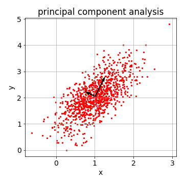

# Principal component analysis (1901)

## Principal component analysis for dimensionality reduction

### Table of Contents

- [Images](#images)
- [Description](#description)
- [Keywords](#keywords)
- [How to Use](#how-to-use)
- [Calculations](#calculations)
- [References](#references)
- [Author Info](#author-info)

## Images



## Description

"Principal component analysis for dimensionality reduction."

#### Technologies

- Python programming language

## Keywords

 - Dimensionality reduction
 - Covariance matrix
 - Identity matrix
 - Eigenvectors
 - Eigenvalues
 - Determinant

## How to Use

#### Getting started

`git clone https://github.com/berberianareg/Principal-component-analysis.git`

#### Dependencies

see requirements.txt

#### Installation

`pip install numpy`

`pip install matplotlib`

#### Executing the program from command line

`python PCA.py`

#### API Reference

## Calculations

Starting with a square $2 \times 2$ matrix (see covariance matrix in Python).

$$\mathbf{A} = \begin{pmatrix}
0.2 & 0.2 \\
0.2 & 0.5
\end{pmatrix}$$

$\mathbf{Av} = \lambda \mathbf{v}$ where $\mathbf{v}$ is the eigenvector and $\lambda$ is the corresponding eigenvalue.

$\mathbf{Av} = \lambda \mathbf{v}$ can be written as $\mathbf{Av} = (\lambda\mathbf{I}) \mathbf{v}$ where $\mathbf{I}$ is the identity matrix.

$\mathbf{Av} - (\lambda\mathbf{I}) \mathbf{v} = 0$

$(\mathbf{A} - \lambda\mathbf{I})\mathbf{v} = 0$

The equation above is set to zero and the desired solution for eigenvector $\mathbf{v}$ is nonzero. Here, the matrix requires a transformation into a space of lower dimension. This projection into a lower dimension corresponds to a linear transformation where the matrix is squished onto a single line. To perform this transformation, the determinant of the matrix is set to zero.

$\text{det} (\mathbf{A} - \lambda\mathbf{I}) = 0$

$$\mathbf{A} - \lambda\mathbf{I} = \begin{pmatrix}
0.2 & 0.2 \\
0.2 & 0.5
\end{pmatrix} - \lambda\begin{pmatrix}
1 & 0 \\
0 & 1
\end{pmatrix}$$

$$\mathbf{A}-\lambda \mathbf{I} = \begin{pmatrix}
0.2 & 0.2\\
0.2 & 0.5
\end{pmatrix} - \begin{pmatrix}
\lambda & 0\\
0 & \lambda
\end{pmatrix}$$

$$\mathbf{A}-\lambda \mathbf{I} = \begin{pmatrix}
0.2-\lambda & 0.2\\
0.2 & 0.5-\lambda
\end{pmatrix}$$

$$\text{det} \begin{pmatrix}
0.2-\lambda & 0.2\\
0.2 & 0.5-\lambda
\end{pmatrix}=0$$

The goal here is to find the value(s) of $\lambda$ such that the determinant of the matrix is equal to zero.

$(0.2-\lambda)(0.5-\lambda)-(0.2)(0.2) = 0$

$0.1-0.2\lambda-0.5\lambda+\lambda^2-0.04 =0$

$\lambda^2-0.7\lambda+0.06=0$

$(\lambda-0.6)(\lambda-0.1)=0$

$\lambda=0.6;\lambda=0.1$

We now found the values of $\lambda$ where the determinant of the matrix is equal to zero. In other words, when $\lambda=0.6$ or $0.1$, the matrix $\mathbf{A}-\lambda\mathbf{I}$ squishes space onto a single line. This means that there is a nonzero vector $\mathbf{v}$ such that the diagonally-altered matrix $(\mathbf{A}-\lambda\mathbf{I})$ times $\mathbf{v}$ is equal to the zero vector. The next goal is therefore to find the nonzero vector $\mathbf{v}$ such that $(\mathbf{A}-\lambda\mathbf{I})\mathbf{v}=0$.

$$\mathbf{v} = \begin{pmatrix}
x_1\\
x_2
\end{pmatrix}$$

$$\begin{pmatrix}
0.2-\lambda & 0.2\\
0.2 & 0.5-\lambda
\end{pmatrix} \begin{pmatrix}
x_1\\
x_2
\end{pmatrix} = \begin{pmatrix}
0\\
0
\end{pmatrix}$$

---

given $\lambda=0.6$

$$\begin{pmatrix}
0.2-0.6 & 0.2\\
0.2 & 0.5-0.6
\end{pmatrix} \begin{pmatrix}
x_1\\
x_2
\end{pmatrix} = \begin{pmatrix}
0\\
0
\end{pmatrix}$$

$$\begin{pmatrix}
-0.4 & 0.2\\
0.2 & -0.1
\end{pmatrix} \begin{pmatrix}
x_1\\
x_2
\end{pmatrix} = \begin{pmatrix}
0\\
0
\end{pmatrix}$$

$-0.4x_1+0.2x_2=0$

$-0.4x_1=-0.2x_2$

$x_1=1$

$x_2=2$

eigenvector 

$$\mathbf{v} = \begin{pmatrix}
1\\
2
\end{pmatrix}$$

eigenvalue 

$\lambda=0.6$

---

given $\lambda=0.1$

$$\begin{pmatrix}
0.2-0.1 & 0.2\\
0.2 & 0.5-0.1
\end{pmatrix} \begin{pmatrix}
x_1\\
x_2
\end{pmatrix} = \begin{pmatrix}
0\\
0
\end{pmatrix}$$

$$\begin{pmatrix}
0.1 & 0.2\\
0.2 & 0.4
\end{pmatrix} \begin{pmatrix}
x_1\\
x_2
\end{pmatrix} = \begin{pmatrix}
0\\
0
\end{pmatrix}$$

$0.1x_1+0.2x_2=0$

$0.1x_1=-0.2x_2$

$x_1=-2$

$x_2=1$

eigenvector 

$$\mathbf{v} = \begin{pmatrix}
-2\\
1
\end{pmatrix}$$

eigenvalue 

$\lambda=0.1$

---

Check that $\mathbf{Av}=\lambda \mathbf{v}$

$$\begin{pmatrix}
0.2 & 0.2\\
0.2 & 0.5
\end{pmatrix} \begin{pmatrix}
1\\
2
\end{pmatrix} =
0.6\begin{pmatrix}
1\\
2
\end{pmatrix} \Longrightarrow True $$

$$\begin{pmatrix}
0.2 & 0.2\\
0.2 & 0.5
\end{pmatrix} \begin{pmatrix}
-2\\
1
\end{pmatrix} =
0.1\begin{pmatrix}
-2\\
1
\end{pmatrix} \Longrightarrow True $$

---

Normalized eigenvectors (see eigenvectors in Python)

$\sqrt{1^2+2^2}=\sqrt{5}$

normalized eigenvector 

$$\mathbf{v}=\begin{pmatrix}
\frac{1}{\sqrt{5}}\\
\frac{2}{\sqrt{5}}
\end{pmatrix} = \begin{pmatrix}
0.447\\
0.894
\end{pmatrix}$$

$\sqrt{(-2)^2+1^2}=\sqrt{5}$

normalized eigenvector 

$$\mathbf{v}=\begin{pmatrix}
\frac{-2}{\sqrt{5}}\\
\frac{1}{\sqrt{5}}
\end{pmatrix} = \begin{pmatrix}
-0.894\\
0.447
\end{pmatrix}$$

## References

#### Links

- Wikipedia - (https://en.wikipedia.org/wiki/Principal_component_analysis)
- Relevant video - (https://www.youtube.com/watch?v=PFDu9oVAE-g)

## Author Info

- Twitter - [@berberianareg](https://twitter.com/BerberianNareg)
- LinkedIn - [Nareg Berberian](https://www.linkedin.com/in/nareg-berberian-phd-ab6759b9/)

[Back to the Top](#principal-component-analysis-1901)
